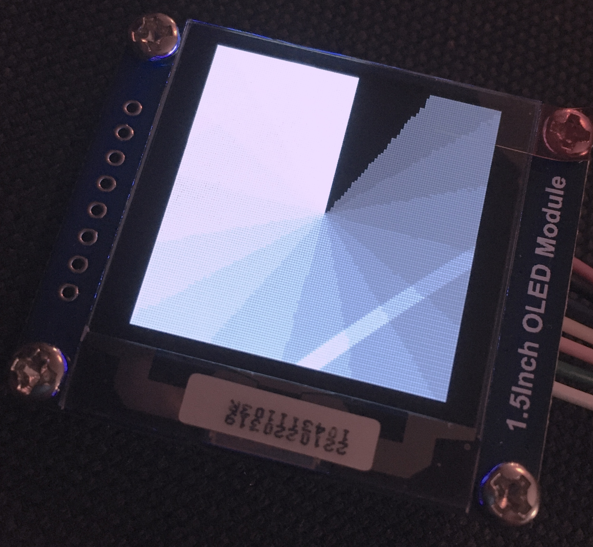

# Work in progress library for SSD1327 OLEDs

## Why another library?

There aren't a lot of options that make sense for this display yet. u8g2 is a
nice library, but only does monochrome, not grayscale. There are some libraries
that do what the developer needed for the one project they had, but not
something that is generic and supports most or all of the displays features.
Additionally lot's of these types of libraries require Arduino to be used.

This is an attempt at a lightweight C++ implementation that does all of the
above. It does support Arduino out of the box but doesn't require it, if you
use another platform, you will have to make a `write` for it that acts as an
abstraction to send data to the screen.

It has a simple API, you make an OLED object and you control it, Arduino
example:

``` c++
#include <Arduino.h>
#include <Wire.h>
#include <ssd1327Arduino.h>
#include "gscale.h"
#define SCL 4
#define SDA 5
#define OLED_WIDTH 128
#define OLED_HEIGHT 128
#define OLED_ADDRESS 0x3c
#define I2C_FREQUENCY 400000L

Ssd1327Arduino oled(&Wire, OLED_ADDRESS, OLED_WIDTH, OLED_HEIGHT);

void setup() {
    Wire.begin(SDA, SCL, I2C_FREQUENCY);
    oled.begin();
    oled.resetRange();
    oled.setStartLine(0);
    oled.clear();
    oled.renderImageData(
        0,
        0,
        gscale_width,
        gscale_height,
        (uint8_t*)gscale_bits,
        sizeof(gscale_bits)
    );
}

void loop() {}
```

On boot..



## Hardware Requirements

It probably won't work on boards like Arduino Uno, because of a lack of
resources. The target micro controller is in the STM32f103 range. But works on
ESP32s, and any controller that can render images at a tolerable speed, at
least double digit MHz, at least 64K RAM is recommended. One frame buffer will
be 8K, you will want to use 2 frame buffers. Rendering is mostly done in stack
memory and is memory efficient but there are some limitations when memory is
scarce. 8-bit controllers should work but 16 or better yet: 32-bit is
recommended because doing the mostly integer operations on larger registers
will be significantly faster.

Currently supports all commands except scrolling, features:

- Native support for grayscale 4-bit (16 level) output.
- Python script included for converting images from common image formats (JPEG,
  GIF, PNG, BMP, etc.) to 4-bit grayscale raw data or C header files to include
  in your project.
- Set contrast
- Set drawing range
- Invert display
- Switch all pixels on
- Switch all pixels off
- Set the display to "normal" (none of the last 3)
- Set mux ratio
- Set display clock and clock divider.
- Set voltage, pwm and charge pump timers to control pixel brightness and
  refresh rate, sane defaults provided.
- Display on/off
- Display remapping, allows rotating, swapping pixel nibbles, etc. No rotate
  function provided yet.
- Enable/disable VDD regulator function.
- GPIO control.
- Set custom grayscale levels (set a 7-bit level for each of the 16 grayscale
levels).
- (Un)lock commands from the controller.
- Send raw data to the screen.
- Render an image at x, y coordinates.
- Clear the screen.
- Support uneven width images (1 bytes controls 2 pixels, can't send half a
  byte, requires adding empty half bytes and shifting the following pixels for
  every other row).

Not yet implemented:

- Frame buffers (first on the list of priorities).
- Rotating
- Graphics primitives (may or may not be added to the project, if not an
  example of using an external library will be added, most likely this will
  do anti aliased rendering of lines and fonts, since it looks a lot nicer and
  can be displayed on a grayscale display..
- SPI support (I don't have an SPI display to test with but it's on the way).
- Document the API.
- This is a work in progress, this library is not production ready!

Tested with a 128x128 I2C screen, should work with any dimension up to 256
pixels but does not yet support SPI (to be implemented), nor 8080 or 6800
(probably never unless someone else adds it through a PR).
